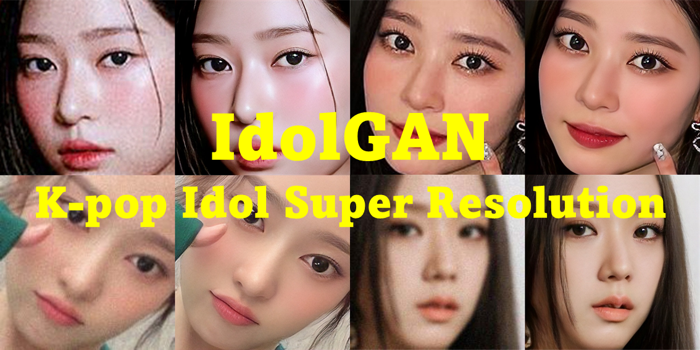

# IdolGAN ~~[adoːkẽꜜɴ]~~




# Overview

IdolGAN project is inspired by our pure passion which is **restoration of our favorite Korean idols to high quality images**. So we googled about it. But many SR models like Topaz can't generate an image we are satisfied with. We think models trained by FFHQ or Celeb-A never restore our favorite idols to high quality properly. Therefore, we gather many high-quality K-pop Idol images from the internet. Most important part is face. Satisfactory thereshold of face image quality is more higher than the other parts of human images (etc. arm, legs or feet). So we collect about 6,000 K-pop girl group images at least 512\*512 size, even the face alone! We build these images to dataset called **[KID-F](https://github.com/PCEO-AI-CLUB/KID-F))**.

In this repo, we will archive our journey to restore perfect high quality Korean idol face images. We finished our first step which is proving our hypothesis : fat pops and wrinkled old woman in FFHQ, Celeb-A or etc can't generate our beauiful idol's face. ❤️

We used [HiFaceGAN](https://github.com/Lotayou/Face-Renovation) and [KID-F Dataset](https://github.com/PCEO-AI-CLUB/KID-F).

# Usage
### Environment
#### for HiFaceGAN
- Ubuntu
- PyTorch 1.0+
- CUDA 10.1
- python packages: opencv-python, tqdm, 
- Data augmentation tool: [imgaug](https://imgaug.readthedocs.io/en/latest/source/installation.html#installation-in-pip)
- [Face Recognition Toolkit](https://github.com/ageitgey/face_recognition) for evaluation
- [tqdm](https://github.com/tqdm/tqdm) to make you less anxious when testing :)
- cv2 

#### for crop.py
- cv2
- mediapipe
- tqdm  

#### for degrad.py
- cv2
- tqdm
  
# Checkpoint
We provide Model Checkpoint which trained from KID-F Dataset. We used train_dataset of KID-F for training, which takes 2 days on a single GTX 1080 Ti. We upload the checkpoint on our [Google Drive](https://drive.google.com/drive/folders/1GrZIofQc3uWFVWserxgPEO97DZEJYOuK?usp=sharing).

# Configurations
The configurations is stored in `options/config_hifacegan.py` in [HiFaceGAN](https://github.com/Lotayou/Face-Renovation/blob/master/options/config_hifacegan.py) You need to edit train&test dataset root, each(train/test) option name, and netG to 'lipspade' for using KID-F dataset. 

# Evaluation
We used PSNR, SSIM, FID, LPIPS, IDD for evaluation.

# Benchmark
We compared HiFaceGAN's performance of KID-F test images with 5 metrics (PSNR, SSIM, FID, LPIPS, IDD).
Column FFHQ is metrics calculated from pretrained model (HiFaceGAN) with FFHQ Downloaded from [HiFaceGAN](https://github.com/Lotayou/Face-Renovation).
Column Idol Dataset (Ours) calculated from HiFaceGAN trained with [KID-F](https://github.com/PCEO-AI-CLUB/KID-F).

The metrics is calculated from KID-F test images (total 300 images, all 512\*512 resolution) inference of each model and original images. 

|            |       FFHQ     |     Idol Dataset (Ours)    |
|:----------:|:--------------:|:--------------------------:|
|      PSNR↑ |      31.82     |            32.49           |
|      SSIM↑ |       0.72     |            0.758           |
|     LPIPS↓ |      0.151     |            0.109           |
|      FID↓  |      0.574     |            0.159           |
|      IDD↓  |     0.00637    |           0.00496          |

# Result
## KID-F Test Images Result


## Real-world Images Result


# Next Level
- [ ] Restore videos, not only images.
- [ ] Fine-tuning SR model to one particular idol.
- [ ] Restore other parts of idol. (like body, clothes, etc.)
- [ ] Restore background at stages or tv shows.

# Contacts
If you have any questions, opinions or advices, please feel free to contact to develop@edai.club
- [Instagram]()
- [Twitter]()

# Citation
```
@notyet{
  title = {},
  author = {Dongkyu Kim, Donggeon Han, Hyunwook Kwon, Dain Jeong, Cheol H. Jeong},
  month = {August},
  year = {2022}
}
```
